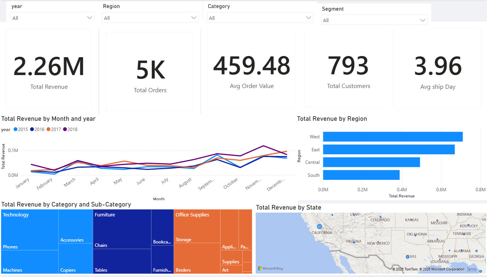
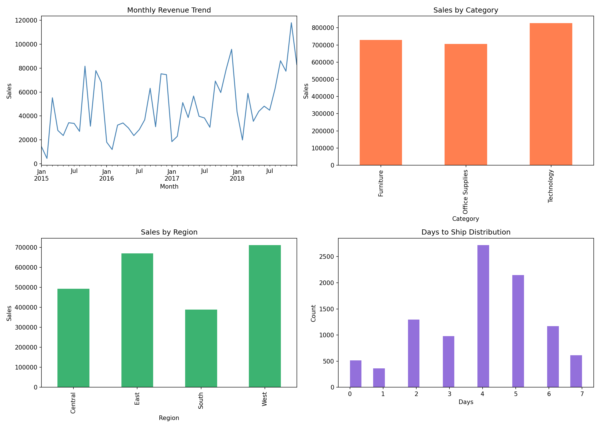

# Sales Performance Dashboard

An end-to-end data analytics project built with SQL, Python, and Power BI using the Superstore Sales dataset (9,800 rows, 2015–2018).

---

## Power BI Dashboard



5-visual interactive dashboard with 4 slicers (Year, Region, Category, Segment):

| Visual | Type | Insight |
|---|---|---|
| KPI cards | Card | Revenue, Orders, Avg Order Value, Customers, Ship Days |
| Monthly trend | Line chart | Revenue by month, split by year |
| Sales by region | Bar chart | Regional revenue comparison |
| Revenue by category | Treemap | Category + sub-category breakdown |
| Sales by state | Map | Geographic revenue distribution |

---

## EDA Charts (Python)



4 charts generated using Python (Pandas + Matplotlib) before building the dashboard:

| Chart | Finding |
|---|---|
| Monthly revenue trend | Consistent upward trend 2015–2018 with Q4 spikes each year |
| Sales by category | Technology leads at ~$836K, Furniture and Office Supplies close behind |
| Sales by region | West highest at ~$725K, South lowest at ~$391K |
| Days to ship distribution | Most orders ship in 4–5 days, average 3.96 days |

---

## Business Questions Answered

- Which regions and categories generate the most revenue?
- How has monthly revenue trended across 2015–2018?
- Which customer segments and ship modes are most common?
- How long does it take to ship orders on average?
- Who are the top 10 highest-revenue products?

---

## Tools & Technologies

| Layer | Tool | Purpose |
|---|---|---|
| Data storage | SQLite | Lightweight local database |
| Data querying | SQL | Business-level analysis queries |
| Data processing | Python (Pandas) | Cleaning, EDA, feature engineering |
| Visualisation | Matplotlib | EDA charts |
| Machine learning | Scikit-learn | Sales prediction (Linear Regression) |
| Dashboard | Power BI | Interactive business dashboard |
| Version control | Git + GitHub | Project management |

---

## Project Structure

```
sales-analysis/
├── data/
│   ├── train.csv                  # Raw Superstore dataset (9,800 rows)
│   └── superstore_clean.csv       # Cleaned dataset exported for Power BI
├── images/
│   ├── eda_charts.png             # EDA chart output
│   └── dashboard_screenshot.png   # Power BI dashboard screenshot
├── powerbi/
│   └── sales_dashboard.pbix       # Power BI report file
├── LoadSQL.py                     # Loads CSV into SQLite database
├── SQLQueries.py                  # 5 core business SQL queries via SQLite
├── EDA.py                         # Data quality checks and stats
├── Charts.py                      # 4 EDA visualisations
├── ML.py                          # Linear regression sales prediction
├── ExportForPowerBI.py            # Feature engineering + CSV export
├── sales.db                       # SQLite database file
└── README.md
```

---

## Key Findings

- **West region** leads in total revenue (~$725K), followed closely by East (~$678K)
- **Technology** is the highest-revenue category, driven by Phones and Machines
- **Revenue grows year-on-year** from 2015 to 2018 with a consistent Q4 spike each year
- **Average shipping time** is 3.96 days — most orders ship in 4–5 days
- **Average order value** is $459 across 5,009 unique orders and 793 customers

---

## SQL Queries Covered

1. Total revenue by year
2. Top 10 products by revenue
3. Sales by region with order count
4. Sales by category and sub-category
5. Monthly revenue trend

---

## Machine Learning

**Model:** Linear Regression  
**Target:** Sales  
**Features:** Days to ship, Region (encoded), Category (encoded), Segment (encoded)  
**Metrics:** R² score and MAE (Mean Absolute Error in dollars)

Baseline model demonstrating feature engineering and sklearn pipeline on real sales data.

---

## How to Run

**1. Clone the repo**
```bash
git clone https://github.com/PrakharBansal888/sales-analysis.git
cd sales-analysis
```

**2. Install dependencies**
```bash
python -m pip install pandas matplotlib scikit-learn
```

**3. Load data into SQLite**
```bash
python LoadSQL.py
```

**4. Run SQL queries**
```bash
python SQLQueries.py
```

**5. Run EDA and charts**
```bash
python EDA.py
python Charts.py
```

**6. Run ML model**
```bash
python ML.py
```

**7. Export for Power BI**
```bash
python ExportForPowerBI.py
```

**8. Open Power BI dashboard**  
Open `powerbi/sales_dashboard.pbix` in Power BI Desktop.

---

## Dataset

- **Source:** Superstore Sales Dataset (available on Kaggle)
- **Rows:** 9,800
- **Columns:** 18 (Order ID, Order Date, Ship Date, Ship Mode, Customer details, Region, Category, Sub-Category, Product Name, Sales)
- **Period:** January 2015 – December 2018

---

## Author

**Prakhar Bansal**  
B.Tech Computer Science (AI) — Parul University  
[GitHub](https://github.com/PrakharBansal888)