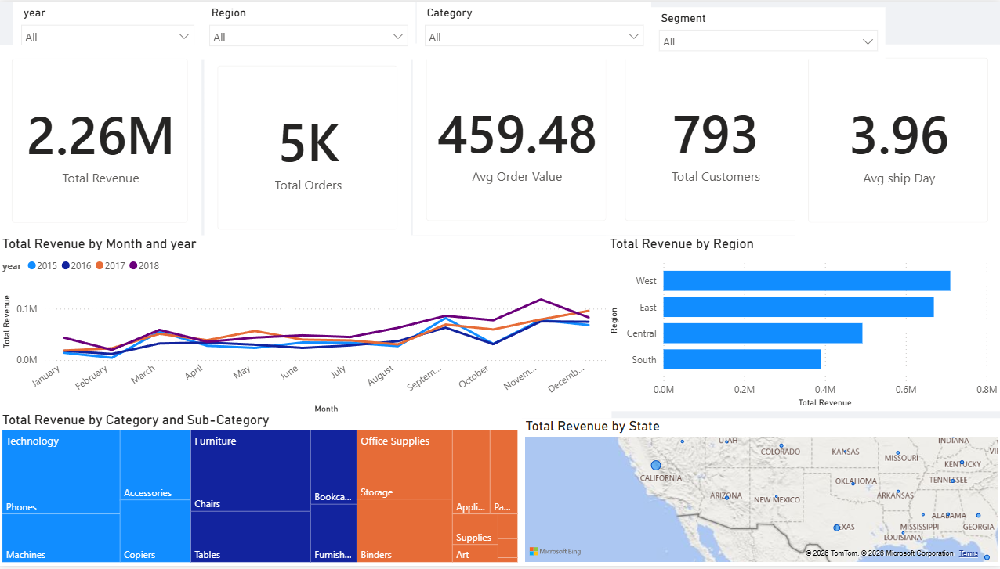
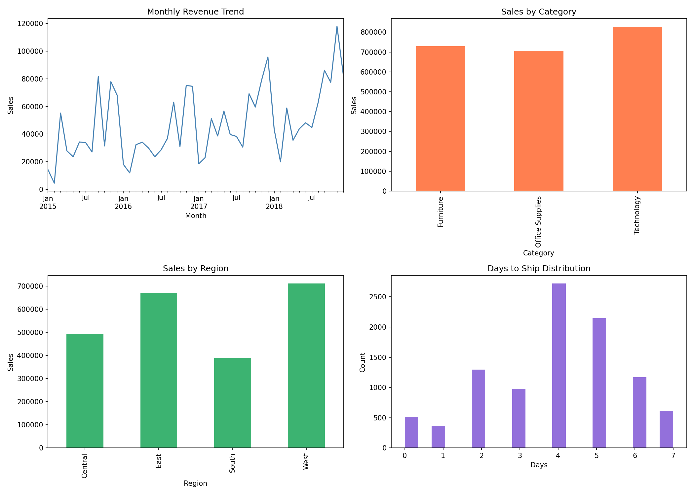

# Sales Performance Dashboard

An end-to-end data analytics project built with SQL, Python, and Power BI using the Superstore Sales dataset (9,800 rows, 2015–2018). Features a **normalised relational schema** (4 tables) and **12 queries incl. joins, CTEs, window functions**.

---

## Power BI Dashboard



5-visual interactive dashboard with 4 slicers (Year, Region, Category, Segment):

| Visual | Type | Insight |
|---|---|---|
| KPI cards | Card | Revenue, Orders, Avg Order Value, Customers, Ship Days |
| Monthly trend | Line chart | Revenue by month, split by year |
| Sales by region | Bar chart | Regional revenue comparison |
| Revenue by category | Treemap | Category + sub-category breakdown |
| Sales by state | Map | Geographic revenue distribution |

---

## EDA Charts (Python)



4 charts generated using Python (Pandas + Matplotlib) before building the dashboard:

| Chart | Finding |
|---|---|
| Monthly revenue trend | Consistent upward trend 2015–2018 with Q4 spikes each year |
| Sales by category | Technology leads at ~$836K, Furniture and Office Supplies close behind |
| Sales by region | West highest at ~$725K, South lowest at ~$391K |
| Days to ship distribution | Most orders ship in 4–5 days, average 3.96 days |

---

## Business Questions Answered

- Which regions and categories generate the most revenue?
- How has monthly revenue trended across 2015–2018?
- Which customer segments and ship modes are most common?
- How long does it take to ship orders on average?
- Who are the top 10 highest-revenue products?
- Which customers drive the majority of revenue (Pareto)?
- What does month-over-month and year-over-year growth look like?
- How do customers segment under RFM scoring?
- What does cohort-based retention look like over time?

---

## Tools & Technologies

| Layer | Tool | Purpose |
|---|---|---|
| Data storage | SQLite | Lightweight local database |
| Data querying | SQL | 12 analytical queries with joins, CTEs, window functions |
| Data processing | Python (Pandas) | Cleaning, EDA, feature engineering |
| Visualisation | Matplotlib | EDA charts |
| Machine learning | Scikit-learn | Sales prediction (Linear Regression) |
| Dashboard | Power BI | Interactive business dashboard |
| Version control | Git + GitHub | Project management |

---

## Project Structure

```
sales-analysis/
├── data/
│   ├── train.csv                  # Raw Superstore dataset (9,800 rows)
│   └── superstore_clean.csv       # Cleaned dataset exported for Power BI
├── images/
│   ├── eda_charts.png             # EDA chart output
│   └── dashboard_screenshot.png   # Power BI dashboard screenshot
├── LoadSQL.py                     # Loads CSV into normalised SQLite schema (4 tables)
├── SQLQueries.py                  # 12 analytical SQL queries (joins, CTEs, windows)
├── EDA.py                         # Data quality checks and stats
├── charts.py                      # 4 EDA visualisations
├── ML.py                          # Linear regression sales prediction
├── Export_PowerBI.py              # Feature engineering + CSV export
├── sales.db                       # SQLite database file
└── Readme.md
```

---

## Key Findings

- **West region** leads in total revenue (~$725K), followed closely by East (~$678K)
- **Technology** is the highest-revenue category, driven by Phones and Machines
- **Revenue grows year-on-year** from 2015 to 2018 with a consistent Q4 spike each year
- **Average shipping time** is 3.96 days — most orders ship in 4–5 days
- **Average order value** is $459 across 5,009 unique orders and 793 customers
- **Pareto effect**: top ~50% of customers (393 of 793) drive 80% of total revenue
- **Repeat purchase rate** is 98.4% — nearly all customers placed more than one order
- **RFM segmentation**: 210 Champions, 262 Loyal, 282 At Risk, and 39 Lost customers
- **Cohort retention**: average monthly retention stabilises around 16–21% across the first 12 months, with a slight uptick at month 12 (21.9%)

---

## SQL Queries Covered

12 queries using joins across normalised tables, CTEs, and window functions:

| # | Query | Techniques |
|---|---|---|
| 1 | Total revenue by year | JOIN, GROUP BY, aggregate |
| 2 | Top 10 products by revenue | JOIN (products), ORDER BY, LIMIT |
| 3 | Sales by region with order count | 3-table JOIN, COUNT DISTINCT |
| 4 | Sales by category & sub-category | JOIN, multi-level GROUP BY |
| 5 | Monthly revenue trend | JOIN, strftime, time-series |
| 6 | Month-over-Month growth | CTE, LAG() window function |
| 7 | Top 3 products per category | CTE, ROW_NUMBER() OVER (PARTITION BY) |
| 8 | Pareto analysis (cumulative revenue) | CTE, cumulative SUM() window |
| 9 | YTD running total per year | CTE, SUM() OVER (PARTITION BY year) |
| 10 | YoY growth by category | CTE, LAG() with PARTITION BY |
| 11 | RFM segmentation | CTE, NTILE(4), CASE expression |
| 12 | Cohort retention | Multi-CTE, date arithmetic, cohort join |

### Database Schema

```
customers(customer_id PK, customer_name, segment, country, city, state, postal_code, region)
products(product_id PK, category, sub_category, product_name)
orders(order_id PK, order_date, ship_date, ship_mode, customer_id FK, days_to_ship)
order_items(row_id PK, order_id FK, product_id FK, sales)
```

---

## Machine Learning

**Model:** Linear Regression
**Target:** Sales
**Features:** Days to ship, Region (encoded), Category (encoded), Segment (encoded)
**Results:** R² = −0.001, MAE = $303.76

The near-zero R² indicates these categorical/logistics features alone do not predict individual sale amounts — sales variance is driven by product choice and quantity, not by region or shipping speed. This is itself a useful finding: delivery logistics have negligible predictive power over order value.

---

## How to Run

**1. Clone the repo**
```bash
git clone https://github.com/PrakharBansal888/sales-analysis.git
cd sales-analysis
```

**2. Install dependencies**
```bash
python -m pip install pandas matplotlib scikit-learn
```

**3. Load data into SQLite (normalised schema)**
```bash
python LoadSQL.py
```

**4. Run SQL queries (12 analytical queries)**
```bash
python SQLQueries.py
```

**5. Run EDA and charts**
```bash
python EDA.py
python charts.py
```

**6. Run ML model**
```bash
python ML.py
```

**7. Export for Power BI**
```bash
python Export_PowerBI.py
```

---

## Dataset

- **Source:** Superstore Sales Dataset (available on Kaggle)
- **Rows:** 9,800
- **Columns:** 18 (Order ID, Order Date, Ship Date, Ship Mode, Customer details, Region, Category, Sub-Category, Product Name, Sales)
- **Period:** January 2015 – December 2018

---

## Author

**Prakhar Bansal**
B.Tech Computer Science (AI) — Parul University
[GitHub](https://github.com/PrakharBansal888)